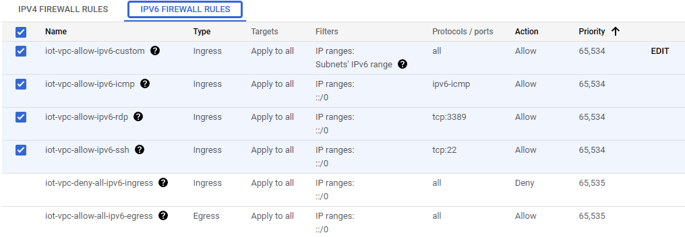
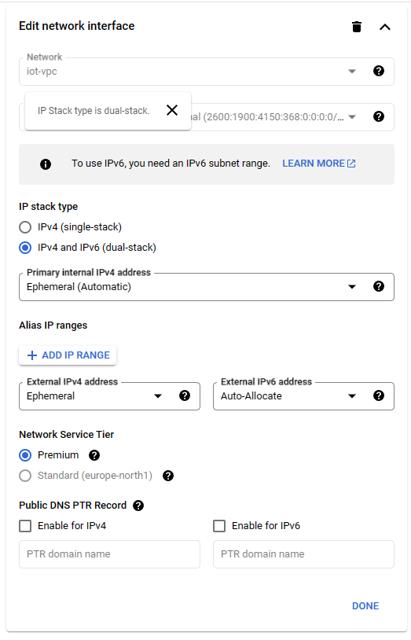

# IoT-miniproject-1

## Overview

### Introduction

**IoT-miniproject-1** is the first part of the project work assigned at the Internet of Things (521043S-3004) course at University of Oulu in 2023. Goal of the project is to create a firmware for a spesific microcontroller, enabling a secure and energy-efficent transmission of sensor data from microcontroller to a cloud-backend using IPv6 protocol. 

The project uses [Fit IoT-Lab](https://www.iot-lab.info/) remote testbed to book IoT-devices, to program them, interact with them and control them.


## Table of Contents

- [Getting Started](#getting-started)
- [Usage](#usage)
- [Code Structure](#code-structure)
- [Authors](#authors)


## Getting Started

### Prerequisites

Before you begin, ensure you have the following:

1. Access to Fit IoT-Lab account.

2. SSH connection to grenoble.iot-lab.info

3. Access to virtual machine running some linux distro to run CoAP server.

### Build the project

1. Connect to grenoble.iot-lab.info:

    ```batch
    ssh <username>@grenoble.iot-lab.info
    ```

2. Clone the repository to your folder of choise at grenoble.iot-lab.info:

    ```bash
    git clone https://github.com/matluuk/IoT-miniproject-1.git
    ```

3. Init the RIOT-submodule:

    ```bash
    git submodule init
    ```

4. Update the RIOT-submodule:

    ```bash
    git submodule update
    ```

5. Change into the miniproject-1 repository working directory:

    ```bash
    cd IoT-miniproject-1/app
    ```

6. Set source:

    ```bash
    source /opt/riot.source
    ```

7. Build the project:

    ```bash
    make
    ```


### Set up Fit IoT-Lab experiment

Set up Fit IoT-Lab experiment with two nodes for device firmware and border router:

1. Connect to grenoble.iot-lab.info IF not already:

    ```batch
    ssh <username>@grenoble.iot-lab.info
    ```

2. Submit an experiment at grenoble for 20 minutes:

    ```bash
    iotlab-experiment submit -n "IoT-miniproject-1" -d 20 -l 2,archi=m3:at86rf231+site=grenoble
    ```

3. Wait for the experiment to be in the Running state:

    ```bash
    iotlab-experiment wait --timeout 30 --cancel-on-timeout
    ```

4. Get the experiment nodes list:

    ```bash
    # Command returns the ID of both nodes, they are needed later!
    iotlab-experiment --jmespath="items[*].network_address | sort(@)" get --nodes
    ```

### Set up border router

1. Connect to grenoble.iot-lab.info IF not already:

    ```batch
    ssh <username>@grenoble.iot-lab.info
    ```

2. Change into the miniproject-1 repository directory:

    ```bash
    cd IoT-miniproject-1
    ```

3. Run flash_border_router.sh after booking the experiment:

    ```bash
    sh flash_border_router.sh <board-id>
    ```

    ```bash
    # Example to get correct <board.id>

    user@grenoble.iot-lab.info:~$ iotlab-experiment --jmespath="items[*].network_address | sort(@)" get --nodes
    [
    "m3-6.grenoble.iot-lab.info",
    "m3-7.grenoble.iot-lab.info"
    ]
    # In this example <board-id> = 6 or 7
    # Only need to pick one ID!
    ```

4. Check which tap interfaces are open:

    ```bash
    ip addr show | grep tap
    ```

5. Check which ipv6 prefixes are already used:

    ```bash
    ip -6 route
    ```

6. Launch the ethos_uhcpd command with:

    ```bash
    sudo ethos_uhcpd.py m3-<id> tap<num> <ipv6_prefix>::/64
    ```

    ```bash
    # Example to get correct <id>, <num> and <ipv6_prefix>
    
    # For <id>:
    # Use the same ID as you chose earlier with command: sh flash_border_router.sh <board-id>

    #For <num>:
    user@grenoble.iot-lab.info:~$ ip addr show | grep tap
    313: tap0: <NO-CARRIER,BROADCAST,MULTICAST,UP> mtu 1500 qdisc pfifo_fast state DOWN group default qlen 1000
    ...
    316: tap1: <NO-CARRIER,BROADCAST,MULTICAST,UP> mtu 1500 qdisc pfifo_fast state DOWN group default qlen 1000
    ...
    582: tap8: <NO-CARRIER,BROADCAST,MULTICAST,UP> mtu 1500 qdisc pfifo_fast state DOWN group default qlen 1000
    ...
    # Example list of network interfaces already in use. This example has 3 network interfaces (eg. tap0, tap1 and tap8). 
    # Choose a free interface, for example <id> = tap8 + 1 = 9

    #For <ipv6_prefix>
    user@grenoble.iot-lab.info:~$ ip -6 route
    2001:660:5307:3100::/64 via fe80::2 dev tap0 metric 1024 linkdown  pref medium
    2001:660:5307:3102::/64 via fe80::2 dev tap2 metric 1024 linkdown  pref medium
    2001:660:5307:3103::/64 via fe80::2 dev tap3 metric 1024 linkdown  pref medium
    2001:660:5307:3104::/64 via fe80::2 dev tap4 metric 1024 linkdown  pref medium
    2001:660:5307:3107::/64 via fe80::2 dev tap100 metric 1024 linkdown  pref medium
    ...
    # Example list of ipv6 prefixes in use. 
    # Choose a free prefix, for example <ipv6_prefix> = 2001:660:5307:3108
    ```

7. After launching ethos_uhcpd, leave the script running!

## Set up server 

For coap server a linux virtual machine is needed. 

Requirements for the virtual machine:
- Ubuntu 20.04
- external IPV6 address for connecting with iot-lab nodes
- coap port 8683 open for ingress traffic
- ICMPv6 traffic allowed for testing ping

Any linux virtual machine should work, but we walk through how to set up Google Cloud virtual machine. Google cloud has a free trial with 300$ credits to use. The virtual machine needs a external IPV6 ip address for connection with the iot-lab node. 

### Set up Google cloud VM

Google Cloud account is needed for using google Cloud services. At the time being, 300 credits can be obtained for use in 3 months time period for free. Below are a link to where a google cloud account can be created.

https://console.cloud.google.com/?hl=en&_ga=2.87814171.-2055644655.1699615458&_gac=1.116033140.1702051941.CjwKCAiAmsurBhBvEiwA6e-WPIQOg4lsX1QJevny4vxo9FBotFtCxOCFgTHR5MXrhSOSkf66HEamdRoCthsQAvD_BwE

#### Create Virtual private cloud

Next step is to create vpc (virtual private cloud) for the VM. This is necessary to bget the external ipv6 address for the VM. The VPC:s can be managed at following google cloud console site.

https://console.cloud.google.com/networking/networks?hl=en&_ga=2.16771894.-1464318792.1699625730&_gac=1.195093086.1701470264.CjwKCAiApaarBhB7EiwAYiMwqnFJQWu6iGIMccKLYWIfXNoxHQGC0UXqAEzLXMDN3NWpUHO9M_Fa9RoC834QAvD_BwE

VPC can be created by pressing the `CREATE VPC NETWORK` button on the top bar.


Below are all the setting I used to create the VPC.

<details><summary>VPC settings</summary>


Select all these firewall rules for both ipv4 and ipv6!




</details>

#### Firewall rules

Firewall rules are a set of instructions that control how a firewall device handles incoming and outgoing traffic. They are access control mechanisms that enforce security in networks by blocking or allowing communication based on predetermined criteria. 

Firewall rules can be managed at Google Cloud firewall rules website: 

https://console.cloud.google.com/net-security/firewall-manager/firewall-policies

For the coap server, a firewall rule that allows udp traffic on CoAp port 8683 must be created.
This rule can be created by clicking the `CREATE FIREWALL RULE` button and using the following settings: 


<details><summary>Firewall rule: allow udp 8683</summary>


</details>

If you have followd according to this tutorial, you should have these firewall rules for the newly created VPC. Notice, wtät there are also some firewall rules for default VPC.


If the firewall rules of your VPC are similar, you can continue.

#### Create Virtual machine

The Virtual machine is used to deploy the Coap server. Google cloud VM:s can be managed from the Google Cloud console instances website.

https://console.cloud.google.com/compute/instances

Click the `CREATE INSTANCE` button. And change the settings mentioned on the dropdown below.


<details><summary>VM instance settings</summary>

Notice! It is important that the VM region is the same as the VPC subnet region.
For the machine type I have chosen the e2-small. This have been enough for the CoAp server.


The linux image should be changed to Ubuntu 20.04 under `Boot Disk`


Under Advanced options the Networking settings must be changed. 

1. Change the Network interface from default to the newly created VPC. 
2. The subnetwork should be automatically selected to the one that you created.
3. Select the `IP stack type` to be IPv4 and IPv6 (dual-stack)


</details>

Now everything should be properly set up and the VM instance can be created.

The SSH connection to the VM instance can be made by clicking the SSH button under Connect. This creates new window with the ssh connection.


### Set up CoAP server to VM

Connect to the linux VM, where you want the the CoAp server to be deployed.

#### **Install all the dependencies and set up the python3 virtual environment.**

1. Clone the repository to your folder of choise:

    ```bash
    git clone https://github.com/matluuk/IoT-miniproject-1.git
    ```

2. update apt-get
    ```bash
    sudo apt-get update
    ```

3. install python3.8-venv
    ```bash
    sudo apt install python3.8-venv
    ```

4. Create and activate new python venv

    ```bash
    python3 -m venv ./CoaP-server-venv
    ```
    ```bash
    source ./CoaP-server-venv/bin/activate
    ```

5. intall autoconf on linux 

    ```bash
    sudo apt-get install autoconf
    ```

6. install python-dev for 

    ```bash
    sudo apt-get install python-dev-is-python3 -y
    ```

7. install build-essential

    ```bash
    sudo apt-get install build-essential
    ```

8. intall aiocoap to python venv

    ```bash
    pip3 install --upgrade "aiocoap[all]"
    ```
#### **Start the CoAp server**

1. move to the Coap server directory
    ```bash
    cd IoT-miniproject-1/Coap-Server/
    ```

2. Start the CoAp server using oyur external ipv6 address and port 8683
    ```bash
    sh start_server.sh ip=<external-ipv6-address-of-the-VM> port=8683
    ```

The `start_server.sh` uses nohup to start the server. Press `enter` to go back to console. Server are now running on the background and can be stopped using the `stop_server.sh` script.
```bash
sh stop_server.sh
```
#### **LOGS**

The CoAp server saves logs of every session under `logs` folder. To take a look on the log created. 
1. Go to the `logs` folder:
    ```bash
    cd logs
    ```

2. This command can be used to show the logs in real time.
    ```bash
    tail -f ./<name-of-the-lates-log-file>.log
    ```
#### **DATA**

The temperature data is stored in files under data folder. Temperature data of every day is saved to it's own file. Notice that the data folder is created, when the first temperature vaule is received.


## Usage

To use this project, follow these guidelines:

1. Connect to grenoble.iot-lab.info IF not already:

    ```batch
    ssh <username>@grenoble.iot-lab.info
    ```

2. Change into the miniproject-1 repository working directory:

    ```bash
    cd IoT-miniproject-1/app
    ```

3. Flash the firmware into the experiment node:

    ```bash
    make IOTLAB_NODE=m3-114 DEFAULT_CHANNEL=18 DEFAULT_PAN_ID=0xbcb4 flash 
    ```

### Free up resources:

After finished with the experiment, stop your experiment to free up the experiment nodes at Fit IoT-Lab:

```bash
iotlab-experiment stop
```


## Code Structure

The project has the following code structure:

```plaintext
.
├── app
│   ├── main.c
│   └── Makefile
├── Coap-Server
│   ├── server.py
│   └── start_server.sh
├── RIOT
│   └── ...
├── flash_border_router.sh
└── README.md
```

## Authors

- **Hermanni Hanhela** - [GitHub Profile](https://github.com/HHanhela)
- **Matti Luukkonen** - [GitHub Profile](https://github.com/matluuk)
- **Touko Kinnunen** - [GitHub Profile](https://github.com/toukokinnunen)
